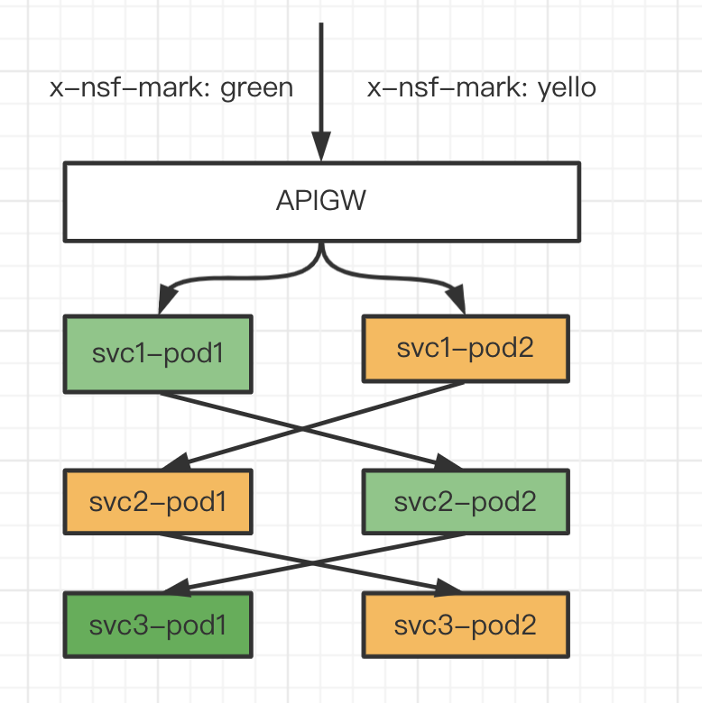

# 流量染色

> 支持版本: v1.1.0+

流量染色是一种路由筛选功能。当流量带有特定的标记（颜色）时，会从目标服务的虚拟环境列表中，选取一个与流量标记最匹配的环境，并将该流量转发到这个虚拟环境中。

# 概念对齐
* 流量标记：
  添加到请求报文中的特定标记，对于http协议，流量标记就是x-nsf-mark请求头；对于dubbo协议，流量标记就是x-nsf-mark attachment

* 虚拟环境
  所谓的虚拟环境，就是打了相同标记的一组实例。当携带某个特定标记的流量被发往某个特定服务时，只会被路由到与这个特定标记匹配的实例上，而不会发往任何其他实例。这样的功能特性，实际上达到了环境隔离的效果：携带各种标记的流量，都会被路由到对应的一组实例中，不会互相干扰。

* 虚拟环境列表
  一个服务的虚拟环境列表，表示这个服务下的实例处于哪些虚拟环境中。一个服务可以有多种虚拟环境列表，类似的，一个svc可以对应多组deploy集合。

* 入口流量
  在微服务体系中的流量入口有通过网关/微服务自身的入口；因此入口流量如果客户端请求没有携带对应的流量标记，需要指定对应的匹配条件进行流量标记。对于网关便是对应的route，对应微服务可以针对dubbo attachement匹配或者restful header匹配对对应的单元进行流量标记。

# 流量染色示意
流量穿梭，意味着带有某一中标记的请求，只会在对应的虚拟环境中进行路由；



# 流量染色envoy实现
Envoy LB Subset的流量染色如下：
https://github.com/envoyproxy/envoy/blob/main/source/docs/subset_load_balancer.md
SLB(Subset Load Balancer) 可以将 Cluster 中的 upstream hosts 划分为 subsets。请求阶段 SLB 会根据请求所携带的标签去匹配 subset, 然后在 subset 内负载均衡。

一个简单的示例：
## 1.cluster配置
下面是 Cluster 配置，metadata 结构中的 qingzhou.qz_colors 携带了所有可用颜色信息。
```yaml
clusters:
- name: svc1
  metadata:
    qingzhou:
	  qz_colors: dev1,dev2
  type:EDS
  lb_subset_config:
    subset_selectors:
	- keys:["qz_color"]
```

对应的EndPoint配置如下
## 2.endpoint配置
下面的这个cluster获取到的eds配置，每个endpoint都在metadata中带有标识的颜色信息qz_color的标签，之后cluster会根据qz_color的取值创建不同的subset
```yaml
resources:
-"@type": type.googleapis.com/envoy.api.v2.ClusterLoadAssignment
  cluster: svc1
  endpoints:
  - lb_endpoints:
    - endpoint:
	  address:
	    socket_address:
		  address: 172.10.0.1
		  port_value: 8080
      metadata:
	    filter_metadata:
		  envoy.lb:
		    qz_color: dev1
    - endpoint:
	  address:
	    socket_address:
		  address: 172.10.0.2
		  port_value: 8080
      metadata:
	    filter_metadata:
		  envoy.lb:
		    qz_color: dev2

```

# 流量染色功能使用

当前Hango网关默认开启流量染色功能，通过请求头携带指定的header(x-nsf-mark)区分流量的染色标识，对流量在指定服务实例间进行转发

## 1.k8s service打标签

对于需要启用流量染色功能服务的service，需要在使用流量染色功能前为其添加流量染色`annotation`信息，用作判断染色标签的亲和性

如下所示，后续`dev1`和`dev2`标签即染色池中的实例标签，具体标签信息根据业务信息定制

```shell
nsf.skiff.netease.com/mark: dev1,dev2
```

## 2.k8s pod打标签

基于上一步对于service的`annotation`后，需要对服务的实例进行打标签，配置实例的染色标识，基于上一步骤我们可以为实例打上标签dev1和dev2，pod增加label如下

```shell
nsf.skiff.netease.com/mark: dev1
```

> pod标签也可以在deployment中预配置

## 3.携带指定头

由于流量染色功能需要携带指定header(`x-nsf-mark`)，因此请求中需要额外携带请求头和对应服务实例的染色标签，例如携带如下头则代表流量达到`dev1`标签的服务实例

> x-nsf-mark: dev1

但在某些场景中这样的要求并非容易实现，后续Hango新版本将推出`请求头部重写`插件，根据请求中的某个header信息对该请求添加x-nsf-mark的头信息

## 4.流量染色行为

```shell
部署情况

service(dev1, dev2)
   │
   ├── pod1(dev1)
   │
   └── pod2(无标签)
```

- 不携带header：x-nsf-mark：dev1; 所有的请求均打到无标签实例
- 携带header：x-nsf-mark：dev1; 所有的请求均打到dev1标签实例
- 携带header：x-nsf-mark：dev2; 请求返回`503` no healthy upstream
- 请求携带没有label的header，header：x-nsf-mark：dev3; 默认降级为不带对应的染色标识header，请求打到无标签实例